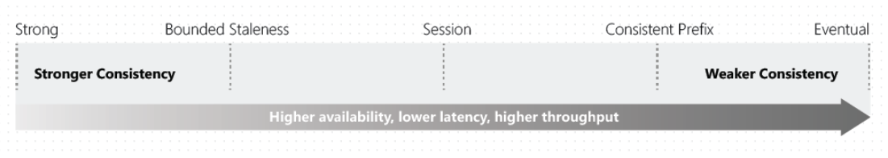

# Contoso CRM

A sample Asp.Net Core Web App using CosmosDB. It emmulates a simple CRM program where the user is able to list, create, edit and delete leads, contacts, and customers.

There are three version of the application:

- .Net Core 2.2 MVC
- .Net Core 2.1 MVC
- .Net Core 2.1 with Angular 6

On every request, the app displays:

- The consumed RUs
- The read and write region
- The consistency level


## Why Cosmos DB?

- It is the first globally distributed database that offers SLA on availability, throughput and latency. 
- If configured with geo-replication, CosmosDB can offer up to 99.999% availability which can help to increase overall availability.
- Supports a number of APIs including SQL (formerly DocumentDB), MongoDB, Cassandra and Gremlin.
- Can be configured with different consistency levels which are suitable for a number of scenarios.
- Can be used both in hot storage and cold storage scenarios.
- Most requests are served in under 10ms. It is so fast it can be used on globally distributted caching.

## Application Performance Optiomizations

The application is based on the following performance optiomizations:

- https://docs.microsoft.com/en-us/azure/cosmos-db/performance-tips

# Code Optimizations:

```
public static DocumentClient Client
        {
            get
            {
                if (client is null)
                {
                    var connectionPolicy = new ConnectionPolicy
                    {
                        // Optionmizations: Use Directing Mode
                        // Gateway mode adds more compatibility but adds and extra hop
                        ConnectionMode = ConnectionMode.Direct,
                        ConnectionProtocol = Protocol.Tcp,
                        EnableEndpointDiscovery = true
                    };
                    // Set preferred locations
                    if (!string.IsNullOrEmpty(PreferredLocations))
                    {
                        foreach(var location in PreferredLocations.Split(','))
                        {
                            connectionPolicy.PreferredLocations.Add(location);
                        }
                    }
                    client = new DocumentClient(new Uri(EndpointUri), AuthKey, connectionPolicy);
                    // Optiomization: OpenAsync()
                    client.OpenAsync().Wait();
                }
                return client;
            }
```

  - Direct Mode vs Gateway Mode
  - Preferred Reading Locations
  - Singleton client instance
  - OpenAsync()
  - For local development, consider using the emulator
    - https://docs.microsoft.com/en-us/azure/cosmos-db/local-emulator

<!--# Additional Code Concepts

```
while (query.HasMoreResults)
            {
                var result = await query.ExecuteNextAsync<T>();

                foreach (var key in result.ResponseHeaders.AllKeys)
                {
                    Debug.WriteLine($"Key: {key} Value: {result.ResponseHeaders[key]}");
                }

                // Information: Calcualte total RUs
                totalRUs += result.RequestCharge;
                results.AddRange(result);
            }

            return new Tuple<double, string, string, IEnumerable<T>>(totalRUs, 
                DocumentDbClientInstance.Client.ReadEndpoint.ToString(), 
                DocumentDbClientInstance.Client.WriteEndpoint.ToString(),
                results);
```

  - Detect and log the RUs
  - Detect and log the read and write regions
-->

# Important Cosmos DB Concepts

## Cosmos SLAs

Azure Cosmos DB is Microsoft’s globally distributed multi-model database service. It offers turnkey global distribution across any number of Azure regions by transparently scaling and replicating your data wherever your users are. The service offers comprehensive **99.99% SLAs which covers the guarantees for throughput, consistency, availability and latency** for the Cosmos DB Database Accounts scoped to a single Azure region configured with any of the five Consistency Levels or Database Accounts spanning multiple Azure regions, configured with any of the four relaxed Consistency Levels. Azure Cosmos DB allows configuring multiple Azure regions as writable endpoints for a Database Account. In this configuration, Cosmos DB **offers 99.999% SLA** for both read and write availability. 

### More About SLAs

- https://azure.microsoft.com/en-us/support/legal/sla/cosmos-db/v1_2/

## Compound Availability

CosmosDB may help in improving compound availability where system A depends on system B. Suppose systems A and B 
have a 99.95% availability. The total compoind availability would be:

```text
A * B = 99.95% * 99.95% = 99.90%
```
> Note: That could mean up to 500 minutes of downtime a year.

But if system B was CosmosDB at 99.999% then the total compound availability would be:

```text
99.95% * 99.999% = 99.949%
```
Note: That could mean up to 250 minutes of downtime a year.

## Preferred Locations and EnableEndpointDiscovery

```
public static DocumentClient Client
        {
            get
            {
                if (client is null)
                {
                    var connectionPolicy = new ConnectionPolicy
                    {
                        // Optionmizations: Use Directing Mode
                        // Gateway mode adds more compatibility but adds and extra hop
                        ConnectionMode = ConnectionMode.Direct,
                        ConnectionProtocol = Protocol.Tcp,
                        EnableEndpointDiscovery = true
                    };
                    // Set preferred locations
                    if (!string.IsNullOrEmpty(PreferredLocations))
                    {
                        foreach(var location in PreferredLocations.Split(','))
                        {
                            connectionPolicy.PreferredLocations.Add(location);
                        }
                    }
                    client = new DocumentClient(new Uri(EndpointUri), AuthKey, connectionPolicy);
                    // Optiomization: OpenAsync()
                    client.OpenAsync().Wait();
                }
                return client;
            }
        }
```

When EnableEndpointDiscovery is true and the value of this property is non-empty, the SDK uses the locations in the collection in the order they are specified to perform operations, otherwise if the value of this property is not specified, the SDK uses the write region as the preferred location for all operations.

If EnableEndpointDiscovery is set to false, the value of this property is ignored.

## RUs

With Azure Cosmos DB, you pay for the throughput you provision and the storage you consume on an hourly basis. Throughput must be provisioned to ensure that sufficient system resources are available for your Azure Cosmos database at all times. You need enough resources to meet or exceed the Azure Cosmos DB SLAs.

he cost of all database operations is normalized by Azure Cosmos DB and is expressed by Request Units (or RUs, for short). You can think of RUs per second as the currency for throughput. RUs per second is a rate-based currency. It abstracts the system resources such as CPU, IOPS, and memory that are required to perform the database operations supported by Azure Cosmos DB.

The cost to read a 1 KB item is 1 Request Unit (or 1 RU). All other database operations are similarly assigned a cost using RUs. No matter which API you use to interact with your Azure Cosmos container, costs are always measured by RUs. Whether the database operation is a write, read, or query, costs are always measured in RUs.

Request Unit considerations
While you estimate the number of RUs per second to provision, consider the following factors:

- **Item size:** As the size of an item increases, the number of RUs consumed to read or write the item also increases.
- **Item indexing:** By default, each item is automatically indexed. Fewer RUs are consumed if you choose not to index some of your items in a container.
- **Item property count:** Assuming the default indexing is on all properties, the number of RUs consumed to write an item increases as the item property count increases.
- **Indexed properties:** An index policy on each container determines which properties are indexed by default. To reduce the RU consumption for write operations, limit the number of indexed properties.
- **Data consistency:** The strong and bounded staleness consistency levels consume approximately two times more RUs while performing read operations when compared to that of other relaxed consistency levels.
- **Query patterns:** The complexity of a query affects how many RUs are consumed for an operation. Factors that affect the cost of query operations include:
  - The number of query results
  - The number of predicates
  - The nature of the predicates
  - The number of user-defined functions
  - The size of the source data
  - The size of the result set
  - Projections
> Azure Cosmos DB guarantees that the same query on the same data always costs the same number of RUs on repeated executions.

- **Script usage:** As with queries, stored procedures and triggers consume RUs based on the complexity of the operations that are performed. As you develop your application, inspect the request charge header to better understand how much RU capacity each operation consumes.

### Exceeding RUs

Cosmos DB will return a status code 429 (Too Many Requests) when RUs are exceeded on any operation (Read, Write, Update, Delete). During performance testing, you should increase load until a small rate of requests get throttled. If throttled, the client application should backoff on throttle for the server-specified retry interval. Respecting the backoff ensures that you spend minimal amount of time waiting between retries. Retry policy support is included in Version 1.8.0 and above of the SQL .NETand Java, version 1.9.0 and above of the Node.js and Python, and all supported versions of the .NET Core SDKs. 

### More About RUs

- https://docs.microsoft.com/en-us/azure/cosmos-db/request-units
- https://www.documentdb.com/capacityplanner

## Consistency Levels

Distributed databases that rely on replication for high availability, low latency, or both, make the fundamental tradeoff between the read consistency vs. availability, latency, and throughput. Most commercially available distributed databases ask developers to choose between the two extreme consistency models: strong consistency and eventual consistency. The  linearizability or the strong consistency model is the gold standard of data programmability. But it adds a price of higher latency (in steady state) and reduced availability (during failures). On the other hand, eventual consistency offers higher availability and better performance, but makes it hard to program applications.

Azure Cosmos DB approaches data consistency as a spectrum of choices instead of two extremes. Strong consistency and eventual consistency are at the ends of the spectrum, but there are many consistency choices along the spectrum. Developers can use these options to make precise choices and granular tradeoffs with respect to high availability and performance.

With Azure Cosmos DB, developers can choose from five well-defined consistency models on the consistency spectrum. From strongest to more relaxed, the models include strong, bounded staleness, session, consistent prefix, and eventual consistency. The models are well-defined and intuitive and can be used for specific real-world scenarios.



### More About Consistency Levels

- https://docs.microsoft.com/en-us/azure/cosmos-db/consistency-levels

> **Note:** this link explains consistency levels through a baseball scenario

## Partitions

Azure Cosmos DB uses partitioning to scale individual containers in a database to meet the performance needs of your application. In partitioning, the items in a container are divided into distinct subsets called logical partitions. Logical partitions are formed based on the value of a partition key that is associated with each item in a container. All items in a logical partition have the same partition key value.

For example, a container holds items. Each item has a unique value for the UserID property. If UserID serves as the partition key for the items in the container and there are 1,000 unique UserID values, 1,000 logical partitions are created for the container.

In addition to a partition key that determines the item’s logical partition, each item in a container has an item ID (unique within a logical partition). Combining the partition key and the item ID creates the item's index, which uniquely identifies the item.

Choosing a partition key is an important decision that will affect your application’s performance.

A logical partition consists of a set of items that have the same partition key. In Azure Cosmos DB, a container is the fundamental unit of scalability. Data that's added to the container and the throughput that you provision on the container are automatically (horizontally) partitioned across a set of logical partitions. Data and throughput are partitioned based on the partition key you specify for the Azure Cosmos container.


### More About Paritions

- https://docs.microsoft.com/en-us/azure/cosmos-db/partitioning-overview
- https://docs.microsoft.com/en-us/azure/cosmos-db/partition-data


#### Application Partiotion

Cotoso CRM uses the following patition key: **/contactType**

## Indexing

In Azure Cosmos DB, every container has an indexing policy that dictates how the container's items should be indexed. The default indexing policy for newly created containers indexes every property of every item, enforcing range indexes for any string or number, and spatial indexes for any GeoJSON object of type Point. This allows you to get high query performance without having to think about indexing and index management upfront. 

### Application Indexing

In the ContosoCRM application, it is not expected that users will search the notes attribute of the document, therefore it has been disabled.

### More About Indexing

- https://docs.microsoft.com/en-us/azure/cosmos-db/index-policy

<!--
## Contact Model

```
public class Contact
    {
        // This id is automatically created by cosmosdb if it is not set
        [JsonProperty(PropertyName = "id")]
        public string Id { get; set; }

        [JsonProperty(PropertyName = "contactType")]
        [Required]
        [JsonConverter(typeof(StringEnumConverter))]
        public ContactType ContactType { get; set; }

        [JsonProperty(PropertyName = "company")]
        [Required]
        public string Company { get; set; }

        [JsonProperty(PropertyName = "lastName")]
        [Required]
        [Display(Name = "Last Name")]
        public string LastName { get; set; }

        [JsonProperty(PropertyName = "firstName")]
        [Required]
        [Display(Name = "First Name")]
        public string FirstName { get; set; }

        [JsonProperty(PropertyName = "email")]
        [Required]
        public string Email { get; set; }

        [JsonProperty(PropertyName = "phone")]
        [Required]
        public string Phone { get; set; }

        [JsonProperty(PropertyName = "notes")]
        public string Notes { get; set; }
    }
```
-->

